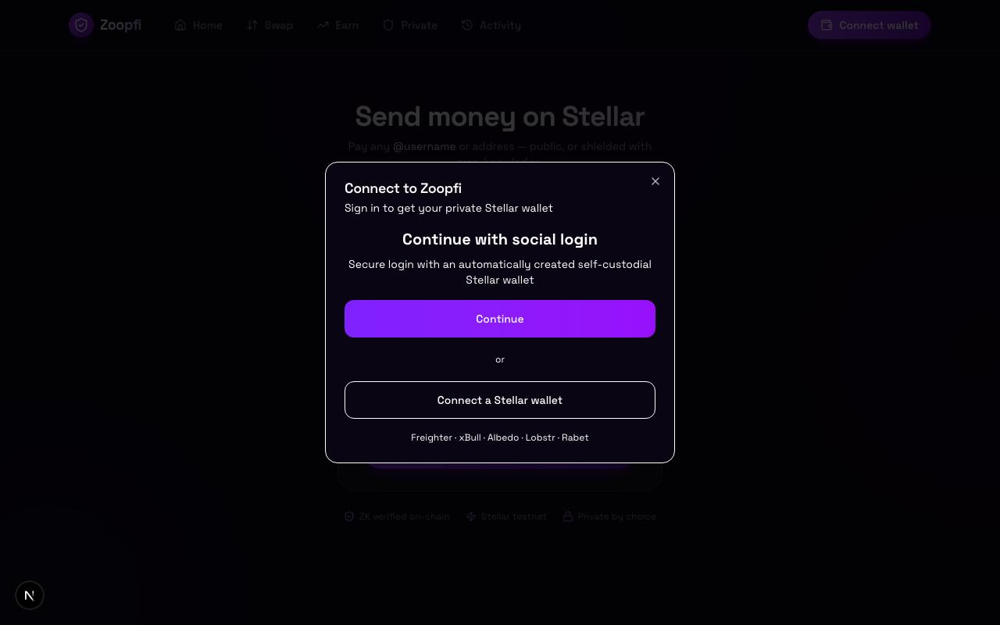

# 🛡️ Zoopfi — the privacy point for Stellar

A consumer + business payments wallet where money moves **privately by default**.
Amounts and counterparties stay hidden, and every private transaction is proven
with a **zero-knowledge proof that is verified on-chain by a Stellar smart
contract**. Compliance is built in via an Association Set Provider (ASP) allow/deny
model, so legitimate users get privacy without the pool becoming a haven for bad
actors.

> **Submission: Stellar Hacks — Real-World ZK.** The ZK is load-bearing: a shielded
> payment cannot be constructed or settled without a valid Groth16 proof that the
> on-chain verifier accepts.

---

## What the ZK actually does

Zoopfi runs a **shielded pool** (a Privacy-Pools / Tornado-style UTXO design) on
Stellar testnet:

- **Notes & commitments.** Funds in the pool are represented as notes. A note
  commitment is `Poseidon2(amount, owner_pubkey, blinding)` — published on-chain,
  revealing nothing about amount or owner.
- **Spending in zero knowledge.** To spend, you prove in a Circom/Groth16 circuit
  (over **BN254**, using **Poseidon2** for hashing) that: you know the opening of
  input notes that exist in the pool's Merkle tree, their nullifiers are correct
  (so they can't be double-spent), inputs balance outputs, and the spend satisfies
  the **ASP membership / non-membership** policy. Amounts and the sender↔recipient
  link never appear in the clear.
- **On-chain verification.** The proof is checked by a **Groth16 verifier contract
  on Stellar** (using Protocol 25/26 BN254 host functions). The pool contract only
  mutates state if `verifier.verify(proof, public_inputs) == true`.

Public deposit/withdraw at the pool boundary is visible (like any token transfer);
**in-pool transfers are private**. That boundary is intentional and documented.

---

## 🔗 Deployed on Stellar testnet

Our own deployment (deployer `GCYETQHS…LWI5LR44`). The proof is verified by the
verifier contract below.

| Contract | Address | Explorer |
|----------|---------|----------|
| **Shielded pool** | `CAO6RPMITSCQTUOFUMFCNELXLNURXMQMRBDZLSIKZX36VH7MBA4LD3UA` | [stellar.expert](https://stellar.expert/explorer/testnet/contract/CAO6RPMITSCQTUOFUMFCNELXLNURXMQMRBDZLSIKZX36VH7MBA4LD3UA) |
| **Groth16 verifier** | `CCIRAIRRTZN4QMUE7XVPLBO2II7UQPCPK7GGVSMFJW5HO44LL37SQDCN` | [stellar.expert](https://stellar.expert/explorer/testnet/contract/CCIRAIRRTZN4QMUE7XVPLBO2II7UQPCPK7GGVSMFJW5HO44LL37SQDCN) |
| **ASP membership** | `CANLVYWPTVIBPG2L2PS4GT6BXRXDAWGGZ7PL62WNDXSLWRNGDJYUILHG` | [stellar.expert](https://stellar.expert/explorer/testnet/contract/CANLVYWPTVIBPG2L2PS4GT6BXRXDAWGGZ7PL62WNDXSLWRNGDJYUILHG) |
| **ASP non-membership** | `CB3ECD5HYWQDCB34ZYQWLN3PCVMYUBE3WLLH7IVHG5YJSSN7B3IU4IYE` | [stellar.expert](https://stellar.expert/explorer/testnet/contract/CB3ECD5HYWQDCB34ZYQWLN3PCVMYUBE3WLLH7IVHG5YJSSN7B3IU4IYE) |

The verifier's on-chain interface:

```rust
fn verify(proof: Groth16Proof, public_inputs: Vec<U256>) -> Result<bool, Groth16Error>
```

The deployment record is in [`deployments/testnet.json`](./deployments/testnet.json).

---

## 🧱 Architecture

```
Browser (Next.js / React)
 ├─ Wallets:  Privy social-login embedded wallet  +  StellarWalletsKit
 │            (Freighter / xBull / Albedo / Lobstr / Rabet …)
 ├─ ZK engine (WASM, loaded from /public/js):
 │     prover-worker  → Groth16 proving (arkworks/BN254) + Poseidon2
 │     storage-worker → encrypted note store (OPFS-backed SQLite)
 │     web client     → Merkle proofs, witness assembly, tx prep
 └─ app/lib/privacy/  → engine loader, wallet shim, submit path, usePrivacyPool hook
        │
        ▼  signed Soroban tx
Stellar testnet:  Pool → Groth16 verifier → ASP membership / non-membership
```

- **Proving runs in the browser** (your spending keys never leave the device).
- The ZK engine (circuits, proving keys, Rust→WASM prover) is **forked from
  [NethermindEth/stellar-private-payments](https://github.com/NethermindEth/stellar-private-payments)**
  (Apache-2.0; circuit artifacts LGPL-3.0). We deployed our own instance of the
  contracts, embedded the prover, and built Zoopfi's UI + wallet integration on top.
  See [`public/privacy-legal/`](./public/privacy-legal) for upstream notices.

**Tech:** Next.js 16 · React 19 · TypeScript · Tailwind 4 · `@stellar/stellar-sdk` ·
`@creit.tech/stellar-wallets-kit` · Privy · Circom/Groth16 · BN254 · Poseidon2 · Soroban (Rust).

---

## 🖼️ Wallet options

The login modal offers Privy social login **and** a full StellarWalletsKit picker
(Freighter, xBull, Albedo, LOBSTR, Rabet, Hana, Klever).



---

## 🚀 Run it locally

### Prerequisites
- Node.js 20+
- A Privy app ID (https://dashboard.privy.io) — only needed for social login
- A StellarWalletsKit-supported extension (e.g. Freighter) for the external-wallet path

```bash
npm install            # or: bun install
cp .env.example .env.local
#   NEXT_PUBLIC_PRIVY_APP_ID=...            (social login)
#   NEXT_PUBLIC_CHAIN_ADAPTER=stellar       (real testnet; "mock" for UI-only)
#   NEXT_PUBLIC_STELLAR_NETWORK=testnet
#   privacy contract IDs are pre-filled to our testnet deployment
npm run dev            # http://localhost:3000 — open /shielded
```

The shielded contract addresses ship in `.env.example`, so the ZK feature points
at our live deployment out of the box.

### Rebuilding the ZK engine (optional)
The WASM prover + circuit artifacts are large and gitignored. To regenerate:

```bash
# prereqs: brew install llvm  (wasm-capable clang for sqlite-wasm-rs)
#          rustup target add wasm32-unknown-unknown && cargo install trunk
PRIVACY_ENGINE_SRC=/path/to/stellar-private-payments ./scripts/build-privacy-engine.sh
```

### Redeploying the contracts (optional)
```bash
cd /path/to/stellar-private-payments
deployments/scripts/deploy.sh testnet --deployer <key> \
  --asp-levels 10 --pool-levels 10 --max-deposit 1000000000 \
  --vk-file deployments/testnet/circuit_keys/policy_tx_2_2_vk.json
```

---

## ▲ Deploy to Vercel

It's a standard Next.js app, so Vercel works out of the box. The one caveat: the
ZK proving engine (WASM + circuit artifacts) can't be compiled by Vercel, so the
prebuilt artifacts are **committed** under `public/js` and `public/circuits` and
served as static assets.

1. Import the repo in Vercel (framework auto-detected as Next.js).
2. Set environment variables (Project → Settings → Environment Variables):
   - `NEXT_PUBLIC_PRIVY_APP_ID` — your Privy app id (for social login)
   - `NEXT_PUBLIC_CHAIN_ADAPTER=stellar`
   - `NEXT_PUBLIC_STELLAR_NETWORK=testnet`
   - the contract IDs from `.env.example` (pool / verifier / ASP / vault) — non-secret
3. Deploy. No COOP/COEP headers needed (the engine's workers use message passing,
   not SharedArrayBuffer).

The Express/MongoDB backend is optional — without `NEXT_PUBLIC_API_URL` the app
uses its in-app mock store, so the chain + ZK features work standalone.

## ✅ Status — what's real vs in progress

Honest breakdown (the hackathon explicitly welcomes WIP, so here it is):

| Piece | Status |
|-------|--------|
| Pool + Groth16 verifier + ASP deployed on testnet | ✅ Live (addresses above) |
| ZK proof verified by on-chain contract | ✅ Proven (verifier deployed; proof→verify exercised in the engine's e2e suite) |
| Browser proving engine (Groth16/Poseidon2) embedded in Zoopfi | ✅ Loads + runs in-app |
| Multi-wallet (Privy + StellarWalletsKit) | ✅ Both wired as real sessions |
| Shielded UI: shield / send privately / unshield, live notes + activity | ✅ Built (`/shielded`) |
| Full in-browser end-to-end shield with a funded wallet | 🔄 Final integration test in progress |
| ASP admin console + business selective-disclosure (view-key) view | 🔜 Planned (circuits + contracts already support it) |

**Safety:** unaudited, **testnet-only**, no real-asset value. The shielded stack is a
demo of compliant private payments, not production custody.

---

## 📂 Where to look

- `app/shielded/page.tsx` — the private-payments UI
- `app/lib/privacy/` — engine loader, wallet shim, Soroban submit, `usePrivacyPool` hook
- `app/lib/chain/` — chain abstraction, multi-wallet (`useWallet`), Stellar adapter
- `deployments/testnet.json` — deployed contract addresses
- `docs/stellar-migration/` — research, architecture, and privacy design docs

## 📄 License

Zoopfi app code: MIT. Bundled privacy engine: Apache-2.0 / LGPL-3.0 (see
`public/privacy-legal/`).

---

Built for **Stellar Hacks: Real-World ZK**. Privacy that real people and businesses can actually use.
